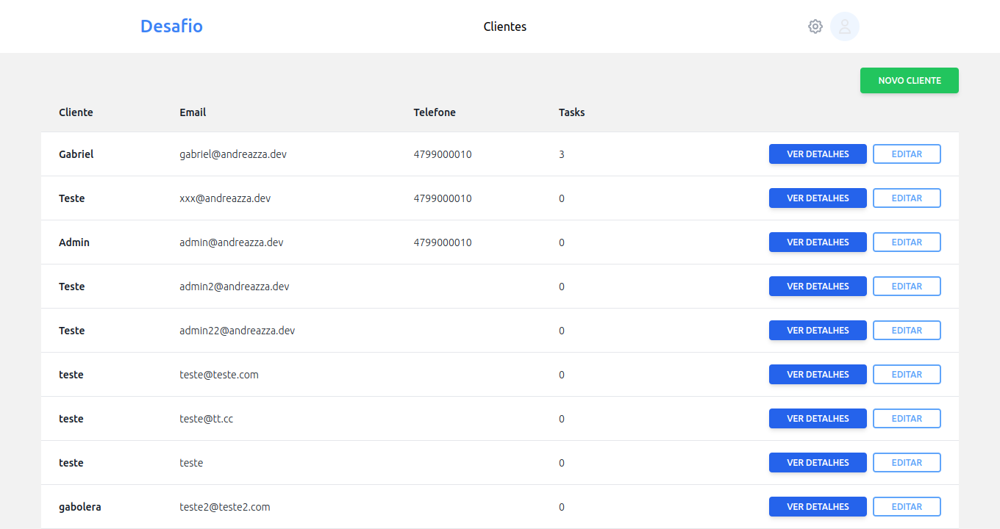
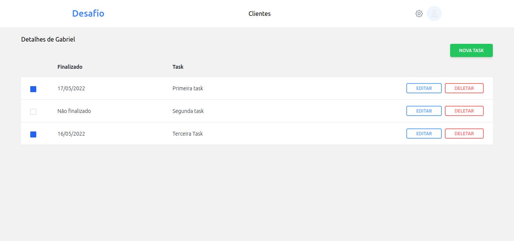
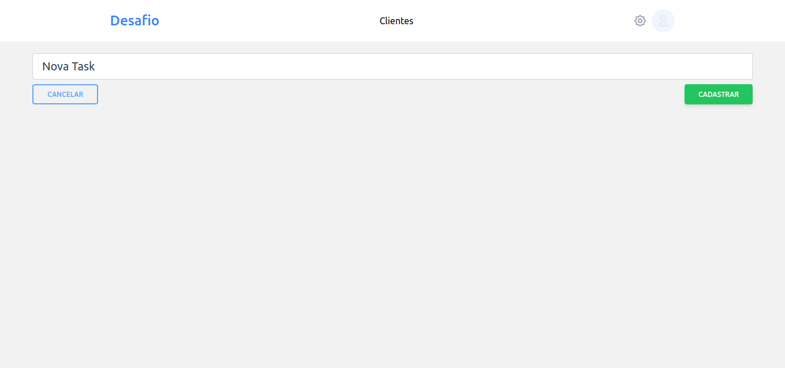
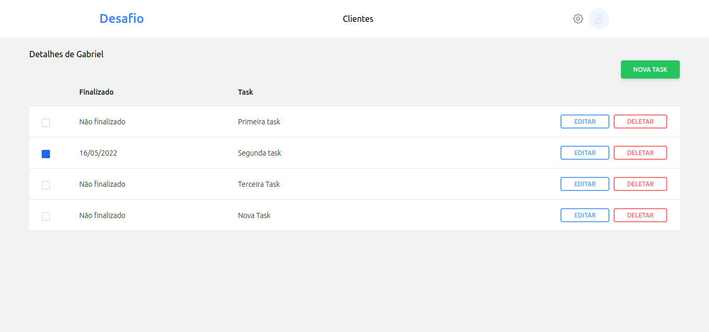

# Challenge-NodeJS-ReactJS


### Situação 

Ainda em desenvolvimento

<br>

### Adicionando hosts para o nginx encontrar a aplicação

`sudo nando /etc/hosts`

```sh
127.0.0.1	api.challenge.local
127.0.0.1	app.challenge.local
```

### Iniciando API

`docker-compose up -d`

`docker-compose exec api composer install`

`docker-compose exec api php artisan migrate`


### Iniciando APP

`cd app`

`yarn i`

`yarn start`


<br>


### Exemplo Front







### Exemplo Backend

Temos na raiz desse projeto o arquivo para poder abrir no Insomnia e testar a aplicação